<div align="center">

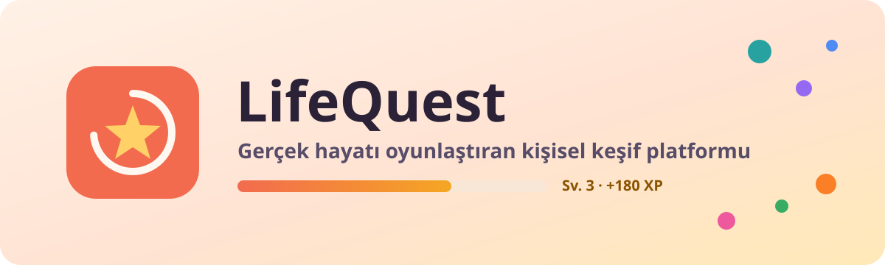

<br />

[](https://dotnet.microsoft.com)
[](https://angular.dev)
[](https://www.postgresql.org)
[](https://github.com/gvnuysal/gvn.gvnframework)

[](#testler)
[](#testler)
[](#web-istemcisi)
[](https://github.com/gvnuysal/gvn.gvnai.lifequest/actions/workflows/ci.yml)

**Ekranda daha uzun kalmanı değil, gerçek hayatta daha çok şey yaşamanı hedefleyen bir oyun.**

[Ekranlar](#ekranlar) · [Nasıl çalışır?](#nasil-calisir) · [Mimari](#mimari) · [Hızlı başlangıç](#hizli-baslangic) · [API](#api) · [Analiz değerlendirmesi](docs/analiz-degerlendirmesi.md) · [Simülasyon raporu](docs/simulasyon-raporu.md)

</div>

---

## ✨ Nedir?

LifeQuest; zamanına, bütçene, ilgi alanlarına ve ne kadar keşif istediğine göre **gerçek dünyada yapabileceğin görevler (quest)** önerir. Tamamladığın her deneyim sana **Life XP** ve Keşif, Kültür, Öğrenme, Sosyal, Hareket, Yaratıcılık alanlarında **kategori XP'si** kazandırır. Sistem geri bildirimlerinden öğrenir ve önerileri giderek sana göre şekillendirir.

| | |
|---|---|
| 🧭 **Kontrollü keşif** | Sakin · Dengeli · Şaşırt Beni. Yeniliğin dozunu sen seçersin. |
| 💡 **Açıklanabilir öneriler** | Her önerinin yanında *"neden bunu önerdik?"* açıklaması ve skor dökümü vardır. |
| 🌱 **Sağlıklı oyunlaştırma** | Streak yok, kayıp korkusu yok. Süresi dolan görevin cezası da yok. |
| 🕸️ **Taste Graph** | *Kahve → Kafe Kültürü → Mimari → Fotoğrafçılık* gibi komşu ilgi alanlarına geçiş. |
| 🔒 **Önce mahremiyet** | Konum takibi yok, fotoğraf doğrulaması yok. Tek tıkla tüm veriler silinir (KVKK/GDPR). |
| 🛡️ **Güvenli katalog** | 142 editoryal template, her ilgi alanında en az 4 görev; her biri güvenlik kontrol listesinden CI'da geçer. Gece açık hava görevi yok; efor sınırına saygı. |
| 🃏 **Hızlı ısınma** | Onboarding'deki "Sana göre mi?" kartları ilk günden isabetli öneri sağlar. |
| 📬 **Suçlamayan haftalık özet** | Bildirim yalnızca seçersen; varsayılan, uygulama içi haftalık özet. |
| 💾 **Sonra yaparım + takvim** | Beğendiğin öneriyi kaybetme; kabul ettiğini planla ve `.ics` ile kendi takvimine ekle. Çok sevdiğin deneyim, bir süre sonra yeniden önerilir. |
| 💡 **Topluluk fikirleri** | Kendi deneyim fikrini öner; ekip inceler, güvenliyse kataloğa girer. Kimliğin deneyimle paylaşılmaz. |
| 🧪 **A/B deneyleri** | Öneri ağırlıkları önce kullanıcıların bir kısmında denenir, north-star ve güven aralığıyla karşılaştırılır. |
| 📦 **Verilerin senin** | "Verilerimi indir" ile tüm verin JSON olarak iner (KVKK/GDPR veri taşınabilirliği). |
| 🧑‍💼 **Denetlenebilir yönetim** | Kullanıcı askıya alma/silme, katalog inceleme kuyruğu ve canlı öneri ağırlıkları; her işlem gerekçesiyle denetim kaydında. |

---

<a id="ekranlar"></a>

## 📱 Ekranlar

<table>
  <tr>
    <td align="center" width="33%">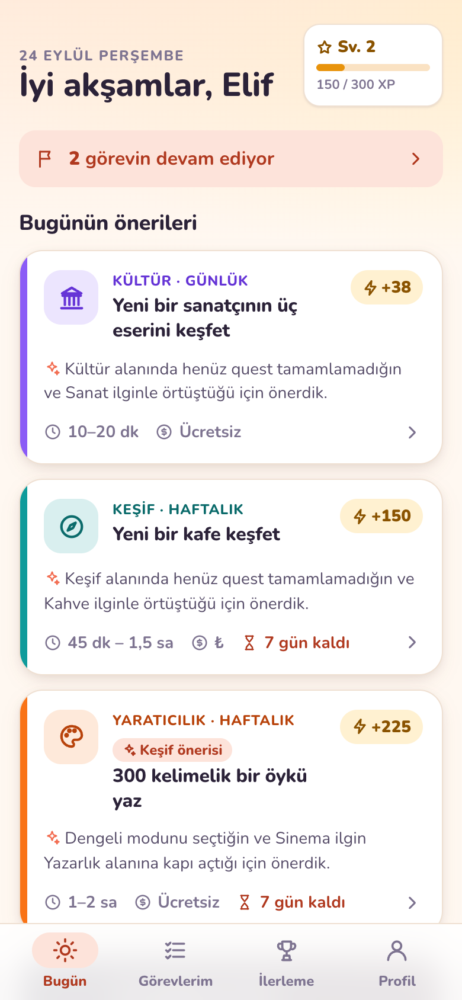<br /><sub><b>Bugün</b><br />Günün 3 önerisi ve gerekçeleri</sub></td>
    <td align="center" width="33%">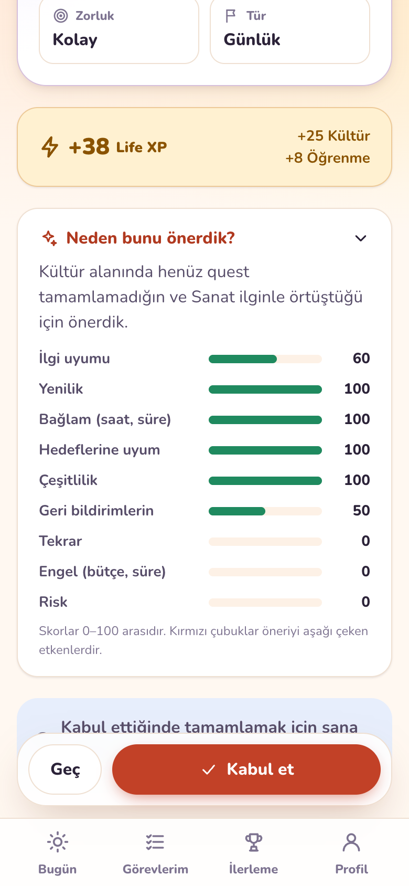<br /><sub><b>Neden bunu önerdik?</b><br />Skor bileşenleri şeffaf</sub></td>
    <td align="center" width="33%">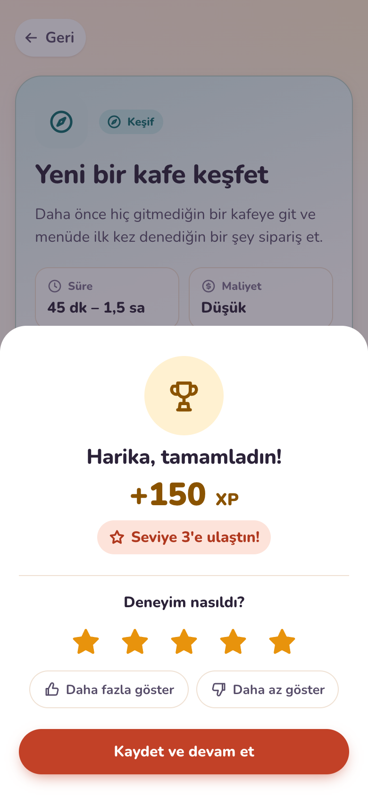<br /><sub><b>Tamamladın!</b><br />XP, seviye ve deneyim puanı</sub></td>
  </tr>
  <tr>
    <td align="center">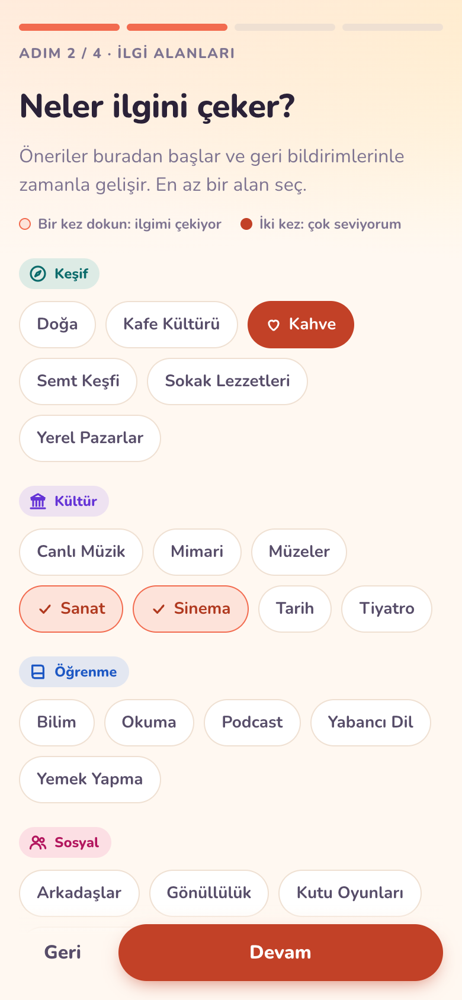<br /><sub><b>Onboarding</b><br />Bir dokunuş: ilgimi çekiyor · İki: çok seviyorum</sub></td>
    <td align="center">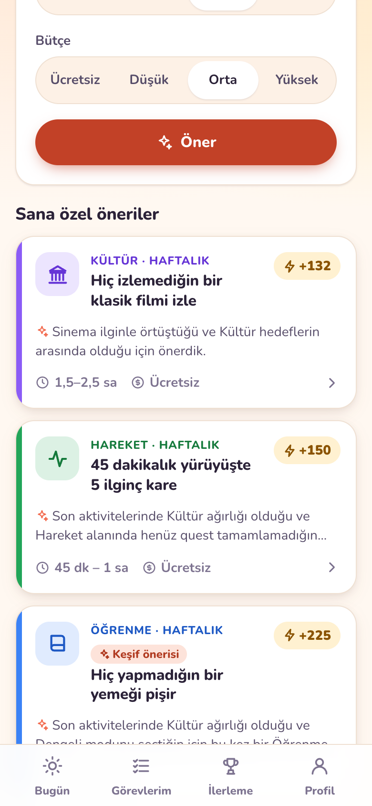<br /><sub><b>"2 saatim var"</b><br />Bağlama göre öneri</sub></td>
    <td align="center">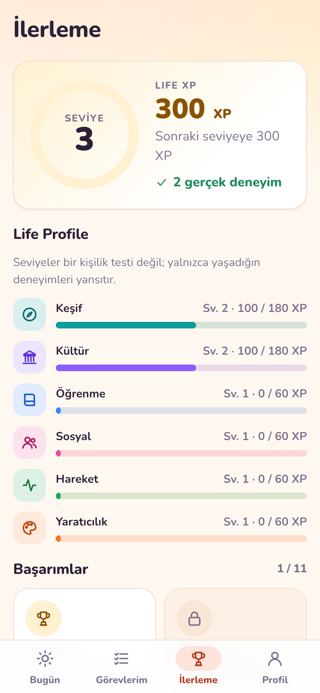<br /><sub><b>İlerleme</b><br />Life seviyesi ve Life Profile</sub></td>
  </tr>
  <tr>
    <td align="center">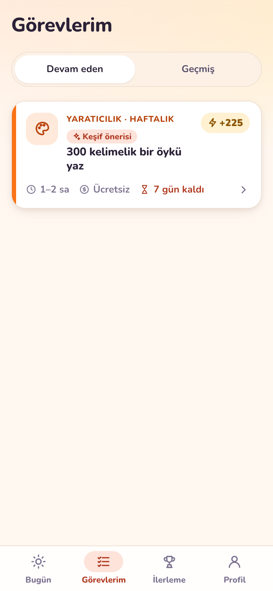<br /><sub><b>Görevlerim</b><br />Devam eden görevler ve geçmiş</sub></td>
    <td align="center">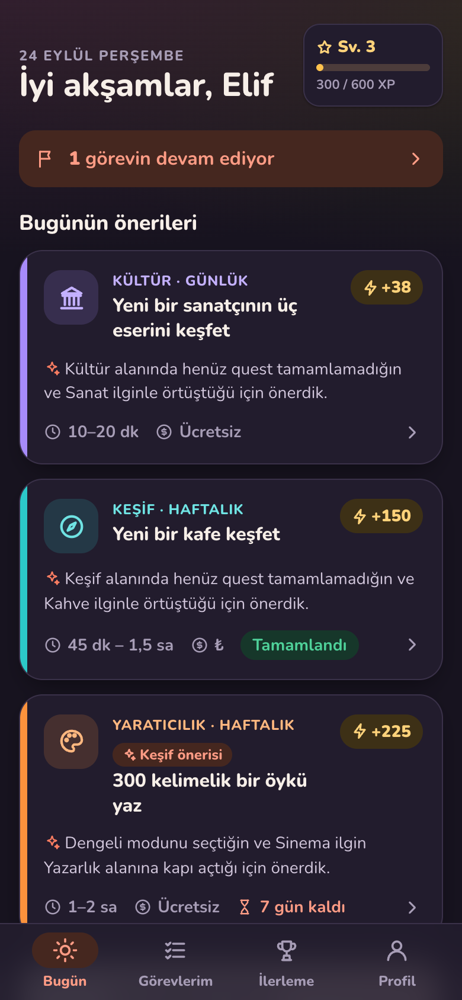<br /><sub><b>Koyu tema</b><br />Sistem tercihine uyar</sub></td>
    <td align="center">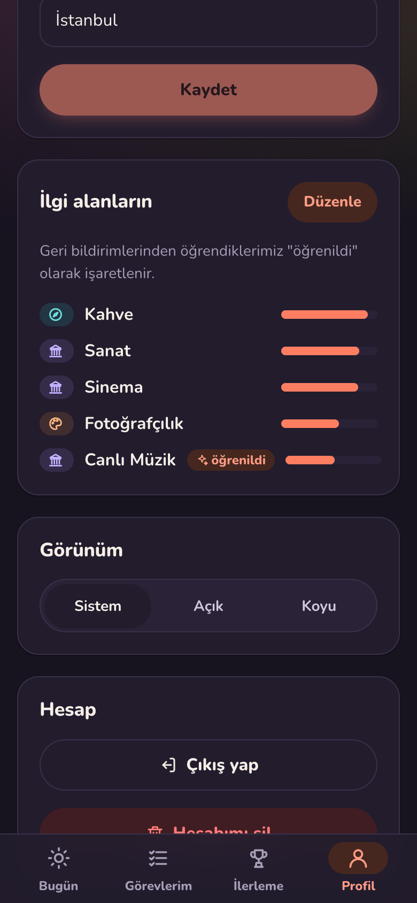<br /><sub><b>Profil</b><br />Öğrenilen ilgiler görünür</sub></td>
  </tr>
</table>

---

<a id="nasil-calisir"></a>

## 🎯 Nasıl çalışır?

### Quest yaşam döngüsü

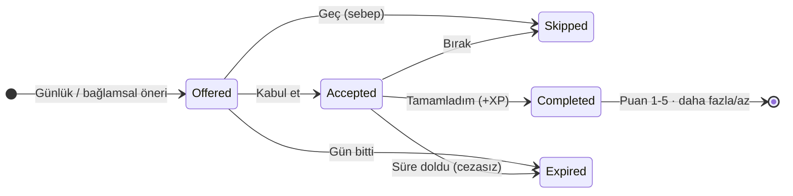

### Öneri motoru

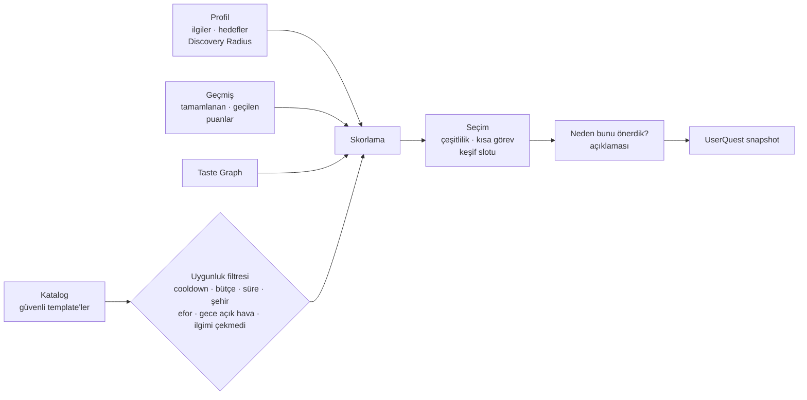

**Skor:** `Interest + Novelty + Context + GoalFit + Diversity + FeedbackFit − Repetition − Friction − Risk`

- Her bileşen 0–1 arasına normalize edilir. Ağırlıklar `appsettings.json → Recommendation` bölümünden yönetilir.
- Discovery Radius, İlgi ve Yenilik ağırlığını değiştirir.
- Diversity her seçimden sonra yeniden hesaplanır. Bu, *"kahve seviyor → hep kahve"* döngüsünü kırar.
- İlk slot mümkünse kısa bir görevdir, böylece ilk 5 dakikada uygulanabilir bir öneri olur.
- Keşif modlarında bir slot kontrollü keşfe ayrılır (Sakin %20, Dengeli %50, Şaşırt Beni her gün). Önce Taste Graph'ta sevdiğin bir ilgiye komşu quest'ler denenir; Sakin modda yalnızca bunlar. Seçim kullanıcı + gün ile tohumlanır, yani tekrarlanabilir ve test edilebilir.
- Son 7 günde gösterilip seçilmeyen öneriler her gösterimde biraz daha geriye düşer.
- "İlgimi çekmedi" ilgi ağırlığını düşürür. "Pahalı / zamanım yok / uzak" ise ilgiyi değil, benzer maliyet ve süredeki önerilerin skorunu etkiler.

### Ekonomi (deterministik, LLM üretmez)

| Kural | Değer |
|---|---|
| Life XP | `BaseXP(tür) × Zorluk × Yenilik` |
| BaseXP | Günlük 30 · Haftalık 120 · Macera 250 · Destansı 500 |
| Zorluk | Kolay 1.0 · Orta 1.5 · Zor 2.0 · Kahramanca 3.0 |
| Yenilik | Yeni kategori 1.25 · yeni template 1.10 · tanıdık 1.0 |
| Kategori XP | Birincil = Life × 2/3 · ikincil = Life × 2/9 (Haftalık/Orta → 180 + 120 + 40) |
| Seviye | `base × (L−1) × L / 2` (Life 100, kategori 60) |
| Çift XP koruması | Append-only `xp_transactions` defteri, `(source_type, source_id)` benzersiz |

### Offline simülasyon

Motor saf olduğu için gerçek domain koduyla 8 persona × 20 tohum × 30 gün simüle edilir (`tools/LifeQuest.Simulation`). Analiz sonrası yapılan motor değişiklikleri, isabet ve north-star'ı koruyarak gizli ilgi keşfini **%48 → %62**'ye çıkardı, tekrar eden öneriyi **%45 → %33**'e indirdi. Ayrıntılar: [simülasyon raporu](docs/simulasyon-raporu.md).


```bash
dotnet run --project tools/LifeQuest.Simulation -- --docs docs
```

### AI Quest Master altyapısı

Anlatım `IQuestNarrator` portu arkasında. Prompt yalnızca PII'siz yapısal alanlardan kurulur. Çıktı `NarrationGuard`'dan geçer: uzunluk, URL, para/XP, uydurma sayı, riskli ifade ve kişisel veri talebi kontrol edilir. 2 sn zaman aşımında veya ihlalde template metnine dönülür. Kategori, süre, maliyet ve XP her zaman template'ten gelir. Varsayılan implementasyon deterministik `TemplateQuestNarrator`.

---

<a id="mimari"></a>

## 🏗️ Mimari

Modular monolith olarak kuruldu. Backend, [**Gvn.GvnFramework**](https://github.com/gvnuysal/gvn.gvnframework) NuGet paketleriyle Clean Architecture katmanlarına ayrılır.

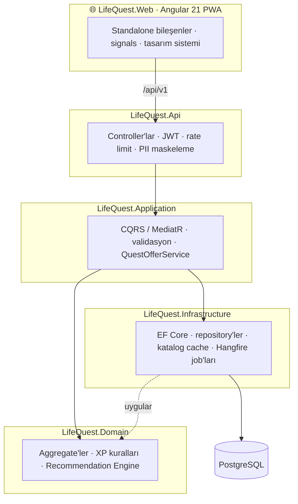

<details>
<summary><b>Proje yapısı</b></summary>

```
src/
├── LifeQuest.Domain          Aggregate'ler, iş kuralları, öneri motoru (saf, I/O'suz)
├── LifeQuest.Application     CQRS use case'leri, öneri orkestrasyonu, DTO'lar
├── LifeQuest.Infrastructure  EF Core + PostgreSQL, repository'ler, seed, job'lar, modüller
├── LifeQuest.Api             Controller'lar, kimlik, rate limit, log maskeleme
└── LifeQuest.Web             Angular PWA istemcisi
tests/
├── LifeQuest.Domain.Tests            Öneri motoru, ekonomi ve aggregate testleri
├── LifeQuest.Application.Tests       Narration guard/fallback, metrikler, haftalık özet
├── LifeQuest.Catalog.Tests           Editoryal güvenlik kuralları (CI kapısı)
└── LifeQuest.Api.IntegrationTests    Testcontainers PostgreSQL ile uçtan uca testler
tools/
└── LifeQuest.Simulation              Offline öneri simülasyonu ve rapor üretimi
docs/
├── analiz-degerlendirmesi.md         Ürün analizi değerlendirmesi ve framework bulguları
└── simulasyon-raporu.md              Persona simülasyonu, ablasyon ve öneriler
packages/gvnframework/                Gvn.GvnFramework NuGet paketleri (yerel kaynak, bkz. nuget.config)
scripts/update-framework-packages.sh  Framework paketlerini günceller
.github/workflows/ci.yml              Build + test (Testcontainers) + web + Docker imajları
.github/workflows/deploy-test.yml     Deploy_Lifequest_Test → testler → self-hosted runner ile test ortamına deploy
deploy/test/                          Test ortamı: compose, Caddyfile, deploy/rollback/setup script'leri
docker-compose.yml                    postgres · redis (opsiyonel) · app profili: api + web (nginx)
```

Modüller (framework `IModule`, `LoadModules` ile yüklenir): **Persistence · Identity · Profile · Catalog · Quest · Progression · Notification · Admin**

</details>

<details>
<summary><b>Gvn.GvnFramework kullanımı</b></summary>

| Paket | LifeQuest'te kullanımı |
|---|---|
| Core | `Result<T>`, `Error`, `Guard`, exception'lar, `Batch` |
| Domain | `AggregateRoot`, `Entity`, `ValueObject` (`QuestReward`), `ISoftDeletable`, `IRepository`, `IUnitOfWork` |
| Application | `ICommand`/`IQuery` + handler'lar, pipeline behavior'lar, `PagedRequest`/`PagedResult` |
| EntityFrameworkCore | `GvnDbContext<T>` (audit, soft delete, domain event), `EfRepository`, `UnitOfWork<T>` |
| Security | JWT, BCrypt, `ICurrentUserService` |
| Caching | Katalog snapshot cache'i (Memory / Redis) |
| BackgroundJobs | Periyodik job'lar (`IRecurringJob`, `IBackgroundJobService`) |
| Logging · AspNetCore · Swagger | Serilog, `ApiControllerBase`, middleware'ler, OpenAPI + Scalar |
| Modularity · DependencyInjection | Modül kaydı, `Decorate` |

Framework'te bulunan sorunlar ve LifeQuest'teki geçici çözümler [analiz değerlendirmesi](docs/analiz-degerlendirmesi.md#4-gvngvnframework-bulguları) dokümanında.

</details>

---

<a id="hizli-baslangic"></a>

## 🚀 Hızlı başlangıç

**Gereksinimler:** .NET 10 SDK · Node 20+ · Docker

> Gvn.GvnFramework paketleri repoda (`packages/gvnframework`) tutulur; ek kurulum gerekmez. Framework'ü güncellemek için `scripts/update-framework-packages.sh` kullan.

**Tek komutla tam uygulama (Docker):** API + web (nginx) + PostgreSQL.

```bash
cp .env.example .env
```

```bash
docker compose --profile app up -d --build
```

Uygulama http://localhost:8081 adresinde açılır. `.env` içindeki `ADMIN_EMAIL` ile kaydolan hesap admin olur.

**Geliştirme ortamı:**

**1. Veritabanını başlat.**

```bash
docker compose up -d postgres
```

**2. API'yi çalıştır.** Migration'lar ve katalog seed'i açılışta uygulanır.

```bash
dotnet run --project src/LifeQuest.Api
```

**3. Web istemcisini kur ve çalıştır.** Geliştirme proxy'si `/api` isteklerini API'ye yönlendirir.

```bash
npm --prefix src/LifeQuest.Web install
```

```bash
npm --prefix src/LifeQuest.Web start
```

| Adres | |
|---|---|
| http://localhost:4200 | 📱 LifeQuest web uygulaması |
| http://localhost:5080/scalar/v1 | 📄 Scalar API arayüzü |
| http://localhost:5080/hangfire | ⏰ Hangfire dashboard (yalnızca localhost) |
| http://localhost:5080/health | ✅ Sağlık kontrolü |

---

### Test ortamı (Docker + CI/CD)

`Deploy_Lifequest_Test` dalına push edilen her sürüm testlerden geçtikten sonra bu Mac'teki Docker'a otomatik deploy edilir:
- UI: https://lifequesttest.gvnaitech.com
- API: https://lifequesttestapi.gvnaitech.com

Caddy (HTTPS) + nginx + ASP.NET + PostgreSQL; her sürüm commit kimliğiyle etiketlenir. Deploy öncesi veritabanı yedeklenir, sağlık kontrolü başarısız olursa önceki sürüme dönülür. Kurulum ve işletme rehberi: [docs/deploy-test.md](docs/deploy-test.md).

<a id="testler"></a>

## 🧪 Testler

```bash
dotnet test LifeQuest.slnx
```

```bash
npm --prefix src/LifeQuest.Web test -- --watch=false
```

| Paket | Kapsam |
|---|---|
| `LifeQuest.Domain.Tests` (89) | Öneri motoru (analizdeki "kahve" senaryosu, efor ve gece açık hava filtreleri, güdümlü ve Sakin keşif dahil), XP/seviye ekonomisi, quest durum makinesi, başarımlar, katalog kuralları, haftalık özet metni, hesap askısı, template editoryal kaynağı, ağırlık sınırları, sevdiğini tekrarla, planlama, deney durum makinesi ve deterministik atama, fikir incelemesi, görev günü sınırı, ilgi kapsama kuralı |
| `LifeQuest.Application.Tests` (53) | Narration guard (masum kelimelerde yanlış pozitif yok), zaman aşımı/fallback, PII'siz prompt, north-star hesabı, özet idempotency'si, admin komut doğrulamaları, iCalendar üretimi, deney istatistiği (Welch güven aralığı), içerik taraması, log maskeleme (şifre/token yok, e-posta kısmi) |
| `LifeQuest.Catalog.Tests` (147) | 142 seed template'in her biri, katalog dengesi ve ilgi kapsaması: her ilgide ≥ 4 görev, ≥ 1 kısa görev (CI kapısı) |
| `LifeQuest.Api.IntegrationTests` (38) | Gerçek PostgreSQL (Testcontainers): günlük öneri idempotency'si, eşzamanlı tamamlamada çift XP olmaması, yatay erişim, token rotasyonu ve çalınma tespiti, hesap silme, başlangıç kartları, haftalık özet; yönetim: askının anında etkisi, rol değişiminde TOKEN_STALE + refresh, admin kuralları, maskelenmiş denetim, inceleme kuyruğu, cache invalidation, seed'in admin düzenlemesini ezmemesi, sürüm çakışması, ağırlık sınırları; sonra yaparım → başlat → planla → .ics, A/B deneyi uçtan uca (atama, sonuç, kazananı uygulama), fikir tarama/limit/inceleme, veri dışa aktarma (sızıntı yok, rate limit) |
| `LifeQuest.Web` (42, vitest) | Token yenileme interceptor'ı (tek uçuşlu refresh, askı ve eski rol akışı), hata ayrıştırma, formatlayıcılar, JWT rol okuma, dosya adı ayrıştırma, template kodu önerisi, çalışma anı API adresi, İngilizce rotalar ve eski Türkçe adres yönlendirmeleri |

---

<a id="web-istemcisi"></a>

## 📱 Web istemcisi

Angular 21 ile yazıldı: standalone bileşenler, signals, zoneless, Reactive Forms. UI kütüphanesi yok; tasarım sistemi CSS değişkenleriyle kurulu. 6 kategori rengi ve açık/koyu tema var. İkonlar kütüphanesiz SVG.

- **Oturum:** access token yalnızca bellekte tutulur. Refresh token `HttpOnly; Secure; SameSite=Strict` çerezdedir (yol `/api/v1/auth`), JavaScript okuyamaz ve yanıt gövdesinde dönmez. Açılışta oturum çerezle sessizce geri yüklenir; 401 alındığında tek seferlik yenileme yapılır. Eski sürümün `localStorage`'da bıraktığı token ilk açılışta çereze taşınıp silinir.
- **PWA:** service worker yalnızca uygulama kabuğunu önbelleğe alır. API yanıtları mahremiyet nedeniyle önbelleğe alınmaz.
- **Erişilebilirlik:** 44 px dokunma hedefleri, görünür odak, AA kontrast, `prefers-reduced-motion` desteği.
- **Yönetim paneli (`/admin`, yalnızca admin):** Metrikler · Kullanıcılar · Katalog · Fikirler · Deneyler · Öneri ayarları · Denetim kaydı. Askıya alma ve rol değişikliği açık oturumlarda da anında geçerli olur: sunucu her istekte hesabın güncel durumuna bakar (60 sn cache, işlemde temizlenir); eski rolü taşıyan token `401 TOKEN_STALE` alır ve istemci sessizce yeniler.

---

<a id="api"></a>

## 🔌 API (v1)

| Uç | Açıklama |
|---|---|
| `POST /api/v1/auth/register` · `login` · `refresh` · `logout` | Kısa ömürlü JWT, rotasyonlu refresh token |
| `GET /api/v1/catalog/interests` | İlgi alanı kataloğu |
| `GET /api/v1/profile` · `PUT …/onboarding` · `PATCH …/preferences` · `PUT …/interests` | Profil ve tercihler |
| `DELETE /api/v1/profile` | Hesabı ve tüm verileri kalıcı silme (şifre onaylı) |
| `GET /api/v1/quests/today` | Günün 3 önerisi (kullanıcının saat dilimine göre) |
| `POST /api/v1/quests/suggestions` | Bağlamsal öneri: `{ "availableMinutes": 120, "maxCost": "Medium" }` |
| `GET /api/v1/quests/active` · `history` · `{id}` | Aktif görevler, sayfalı geçmiş, skor dökümlü detay |
| `POST /api/v1/quests/{id}/accept` · `complete` · `skip` · `feedback` | Yaşam döngüsü ve geri bildirim |
| `GET /api/v1/progress` · `GET /api/v1/achievements` | XP, seviyeler, başarımlar |
| `GET /api/v1/onboarding/starter-cards` | Cold start kartları (onboarding'de `starterReactions` ile yanıtlanır) |
| `GET /api/v1/summaries/latest` · `POST …/{id}/read` | Okunmamış haftalık özet (yoksa 204) |
| `GET /api/v1/admin/metrics?days=7` | North-star, funnel, skip sebepleri, keşif kabulü (yalnızca `admin` rolü) |
| `GET /api/v1/admin/users` · `GET …/{id}` | Kullanıcı arama (e-posta/ad), filtre (Admin/Askıda); yalnızca hesap bilgisi ve toplamlar |
| `POST …/users/{id}/suspend` · `unsuspend` · `PUT …/role` · `DELETE …/users/{id}` | Askıya alma (1/7/30 gün/süresiz), rol verme/alma, gerekçe + e-posta onaylı kalıcı silme |
| `GET/POST /api/v1/admin/templates` · `GET/PUT …/{id}` · `POST …/validate` | Template arama, oluşturma, sürüm kontrollü düzenleme, kaydetmeden kural kontrolü |
| `POST …/templates/{id}/safety` · `activate` · `deactivate` · `GET /admin/catalog/health` | Onayla / incelemeye al / engelle, yayın durumu, katalog dengesi |
| `GET/PUT /api/v1/admin/recommendation-weights` · `POST …/reset` | Öneri ağırlıkları: sınır kontrollü, anında geçerli, varsayılana dönüş |
| `GET /api/v1/admin/audit?action=` | Denetim kaydı: kim, ne zaman, neyi, neden |
| `POST /api/v1/quests/{id}/save` · `GET /saved` · `POST /saved/{templateId}/start` · `DELETE /saved/{templateId}` | Sonra yaparım listesi; başlatma motorun uygunluk kurallarından geçer |
| `PUT /api/v1/quests/{id}/plan` · `GET …/{id}/calendar.ics` | Kabul edilen görevi planla, iCalendar dosyası (konum içermez) |
| `POST /api/v1/ideas` · `GET …/mine` · `DELETE …/{id}` | Topluluk fikri gönder (bağlantı/iletişim bilgisi yok, 3 bekleyen, günde 5) |
| `GET /api/v1/profile/export` | Tüm verileri JSON olarak indir (saatte 3) |
| `GET/POST /api/v1/admin/experiments` · `GET …/{id}` · `POST …/{id}/start\|stop\|adopt\|discard` | A/B deneyleri: Kontrol/Deneme karşılaştırması, kazananı üretime alma |
| `GET /api/v1/admin/ideas` · `POST …/{id}/reject` · `POST /admin/templates?sourceIdeaId=` | Fikir kuyruğu, reddetme notu, fikirden template |

Hatalar `{ code, message, type }` listesi olarak döner. HTTP kodları: 400 doğrulama · 401 · 404 · 409 çakışma/geçersiz geçiş · 429.

<details>
<summary><b>Konfigürasyon</b></summary>

| Ayar | Açıklama |
|---|---|
| `ConnectionStrings:LifeQuest` | PostgreSQL bağlantısı |
| `Jwt:Secret` | **En az 32 bayt.** Üretimde `Jwt__Secret` ortam değişkeni veya user-secrets ile verilir. `appsettings.Development.json` içindeki değer yalnızca geliştirme içindir. |
| `Database:MigrateOnStartup` | Yalnızca geliştirme için. Üretimde migration ayrı bir adımdır. |
| `Cache:UseRedis` | `docker compose --profile redis up -d` ile Redis |
| `BackgroundJobs:Enabled`, `Hangfire:*` | Hangfire; `Hangfire:StorageProvider` = `PostgreSql` (varsayılan, `hangfire` şeması; yeniden başlatmada işler korunur) veya `InMemory` (geliştirme) |
| `Gvn:Pipeline:Logging`, `Gvn:Pipeline:Performance` | Framework pipeline'ı: istek/yanıt gövdesi loglama (varsayılan kapalı), yavaş istek eşiği |
| `Quests:*`, `Recommendation:*` | Günlük öneri sayısı, aktif görev sınırı, skor ağırlıkları, keşif oranları, tekrar penceresi |
| `Narration:TimeoutMilliseconds` | Anlatım zaman aşımı (varsayılan 2000) |
| `Admin:BootstrapEmails` | Açılışta admin rolü verilecek hesaplar (geliştirmede `admin@lifequest.local`) |

Migration eklemek için:

```bash
dotnet ef migrations add <Ad> -p src/LifeQuest.Infrastructure -s src/LifeQuest.Infrastructure -o Persistence/Migrations
```

</details>

---

## 🗺️ Yol haritası

- [x] **Faz 1 · Core:** modular monolith, kimlik, onboarding, katalog, XP, başarımlar, öneri motoru, web istemcisi
- [x] Analiz riskleri: 100 template'lik güvenli katalog, efor/erişilebilirlik, cold start kartları, north-star paneli, haftalık özet, AI anlatım altyapısı, offline simülasyon
- [x] Yönetim paneli: kullanıcılar, katalog inceleme kuyruğu, canlı öneri ağırlıkları, denetim kaydı
- [x] Katma değer: A/B deneyleri, topluluk fikirleri, sonra yaparım + takvim, sevdiğini tekrarla, KVKK dışa aktarma, CI + Docker
- [x] Gvn.GvnFramework 1.1.0-preview'a geçiş: doğrulama, domain event ve log maskeleme geçici çözümleri kaldırıldı · Hangfire kalıcı PostgreSQL deposu
- [x] Test ortamı ve CI/CD: Docker + Caddy (HTTPS), deploy/rollback script'leri, self-hosted runner ile otomatik deploy · İngilizce URL'ler
- [x] Katalog derinliği: 142 template, her ilgide ≥ 4 görev ve ≥ 1 kısa görev (north-star +%9, gizli ilgi keşfi %61 → %70)
- [ ] Katalog: ilgi başına 6 görev · simülasyon önerilerinin A/B testi · ilgi alanı ve Taste Graph düzenleme
- [x] Refresh token'ın HttpOnly + SameSite=Strict çereze taşınması
- [ ] **Faz 2 · Intelligence:** gerçek LLM adaptörü, gelişmiş Taste Graph, contextual bandit
- [ ] Push kanalı ve kullanıcı seçimli günlük hatırlatma
- [ ] **Faz 3 · Real World:** mekân/etkinlik kaynakları, hava durumu bağlamı
- [ ] **Faz 4 · Social:** Quest Party, ortak görevler, kontrollü paylaşım

<div align="center">
<br />
<sub>Gvn.GvnFramework ile geliştirildi · <a href="https://github.com/gvnuysal">@gvnuysal</a></sub>
</div>
