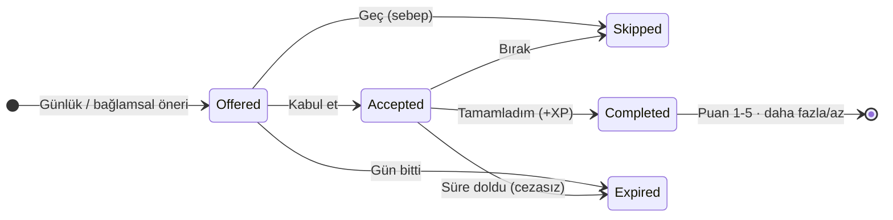
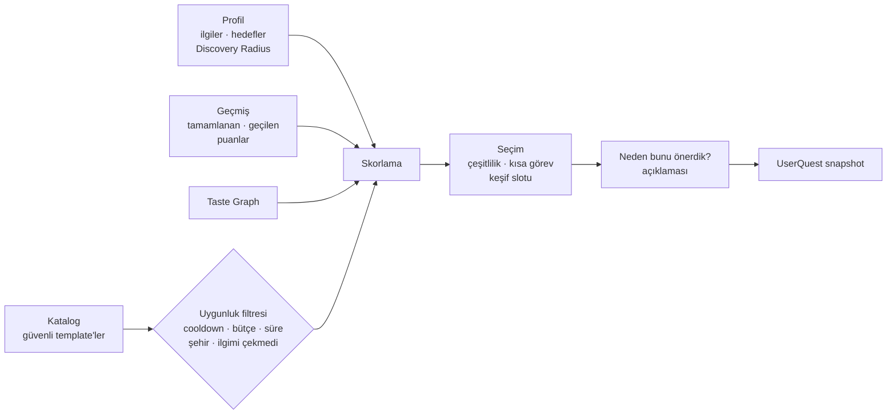
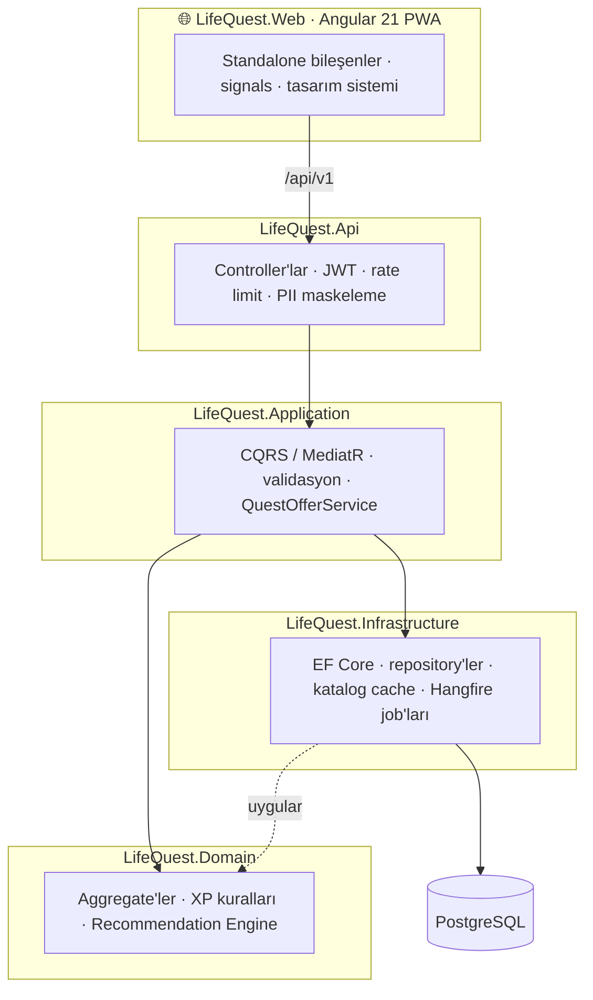

<div align="center">


<br />

[](https://dotnet.microsoft.com)
[](https://angular.dev)
[](https://www.postgresql.org)
[](https://github.com/gvnuysal/gvn.gvnframework)

[](#testler)
[](#testler)
[](#web-istemcisi)

**Ekranda daha uzun kalmanı değil, gerçek hayatta daha çok şey yaşamanı hedefleyen bir oyun.**

[Ekranlar](#ekranlar) · [Nasıl çalışır?](#nasil-calisir) · [Mimari](#mimari) · [Hızlı başlangıç](#hizli-baslangic) · [API](#api) · [Analiz değerlendirmesi](docs/analiz-degerlendirmesi.md)

</div>

---

## ✨ Nedir?

LifeQuest; zamanına, bütçene, ilgi alanlarına ve ne kadar keşif istediğine göre **gerçek dünyada yapabileceğin görevler (quest)** önerir. Tamamladığın her deneyim sana **Life XP** ve Keşif, Kültür, Öğrenme, Sosyal, Hareket, Yaratıcılık alanlarında **kategori XP'si** kazandırır. Sistem geri bildirimlerinden öğrenir ve önerileri giderek sana göre şekillendirir.

| | |
|---|---|
| 🧭 **Kontrollü keşif** | Sakin · Dengeli · Şaşırt Beni. Yeniliğin dozunu sen seçersin. |
| 💡 **Açıklanabilir öneriler** | Her önerinin yanında *"neden bunu önerdik?"* açıklaması ve skor dökümü vardır. |
| 🌱 **Sağlıklı oyunlaştırma** | Streak yok, kayıp korkusu yok. Süresi dolan görevin cezası da yok. |
| 🕸️ **Taste Graph** | *Kahve → Kafe Kültürü → Mimari → Fotoğrafçılık* gibi komşu ilgi alanlarına geçiş. |
| 🔒 **Önce mahremiyet** | Konum takibi yok, fotoğraf doğrulaması yok. Tek tıkla tüm veriler silinir (KVKK/GDPR). |

---

<a id="ekranlar"></a>

## 📱 Ekranlar

<table>
  <tr>
    <td align="center" width="33%"><br /><sub><b>Bugün</b><br />Günün 3 önerisi ve gerekçeleri</sub></td>
    <td align="center" width="33%"><br /><sub><b>Neden bunu önerdik?</b><br />Skor bileşenleri şeffaf</sub></td>
    <td align="center" width="33%"><br /><sub><b>Tamamladın!</b><br />XP, seviye ve deneyim puanı</sub></td>
  </tr>
  <tr>
    <td align="center"><br /><sub><b>Onboarding</b><br />Bir dokunuş: ilgimi çekiyor · İki: çok seviyorum</sub></td>
    <td align="center"><br /><sub><b>"2 saatim var"</b><br />Bağlama göre öneri</sub></td>
    <td align="center"><br /><sub><b>İlerleme</b><br />Life seviyesi ve Life Profile</sub></td>
  </tr>
  <tr>
    <td align="center"><br /><sub><b>Görevlerim</b><br />Devam eden görevler ve geçmiş</sub></td>
    <td align="center"><br /><sub><b>Koyu tema</b><br />Sistem tercihine uyar</sub></td>
    <td align="center"><br /><sub><b>Profil</b><br />Öğrenilen ilgiler görünür</sub></td>
  </tr>
</table>

---

<a id="nasil-calisir"></a>

## 🎯 Nasıl çalışır?

### Quest yaşam döngüsü



### Öneri motoru



**Skor:** `Interest + Novelty + Context + GoalFit + Diversity + FeedbackFit − Repetition − Friction − Risk`

- Her bileşen 0–1 arasına normalize edilir. Ağırlıklar `appsettings.json → Recommendation` bölümünden yönetilir.
- Discovery Radius, İlgi ve Yenilik ağırlığını değiştirir.
- Diversity her seçimden sonra yeniden hesaplanır. Bu, *"kahve seviyor → hep kahve"* döngüsünü kırar.
- İlk slot mümkünse kısa bir görevdir, böylece ilk 5 dakikada uygulanabilir bir öneri olur.
- Keşif modlarında bir slot kontrollü keşfe ayrılır. Seçim kullanıcı + gün ile tohumlanır, yani tekrarlanabilir ve test edilebilir.
- "İlgimi çekmedi" ilgi ağırlığını düşürür. "Pahalı / zamanım yok / uzak" ise ilgiyi değil, benzer maliyet ve süredeki önerilerin skorunu etkiler.

### Ekonomi (deterministik, LLM üretmez)

| Kural | Değer |
|---|---|
| Life XP | `BaseXP(tür) × Zorluk × Yenilik` |
| BaseXP | Günlük 30 · Haftalık 120 · Macera 250 · Destansı 500 |
| Zorluk | Kolay 1.0 · Orta 1.5 · Zor 2.0 · Kahramanca 3.0 |
| Yenilik | Yeni kategori 1.25 · yeni template 1.10 · tanıdık 1.0 |
| Kategori XP | Birincil = Life × 2/3 · ikincil = Life × 2/9 (Haftalık/Orta → 180 + 120 + 40) |
| Seviye | `base × (L−1) × L / 2` (Life 100, kategori 60) |
| Çift XP koruması | Append-only `xp_transactions` defteri, `(source_type, source_id)` benzersiz |

---

<a id="mimari"></a>

## 🏗️ Mimari

Modular monolith olarak kuruldu. Backend, [**Gvn.GvnFramework**](https://github.com/gvnuysal/gvn.gvnframework) NuGet paketleriyle Clean Architecture katmanlarına ayrılır.



<details>
<summary><b>Proje yapısı</b></summary>

```
src/
├── LifeQuest.Domain          Aggregate'ler, iş kuralları, öneri motoru (saf, I/O'suz)
├── LifeQuest.Application     CQRS use case'leri, öneri orkestrasyonu, DTO'lar
├── LifeQuest.Infrastructure  EF Core + PostgreSQL, repository'ler, seed, job'lar, modüller
├── LifeQuest.Api             Controller'lar, kimlik, rate limit, log maskeleme
└── LifeQuest.Web             Angular PWA istemcisi
tests/
├── LifeQuest.Domain.Tests            Öneri motoru, ekonomi ve aggregate testleri
└── LifeQuest.Api.IntegrationTests    Testcontainers PostgreSQL ile uçtan uca testler
docs/
└── analiz-degerlendirmesi.md         Ürün analizi değerlendirmesi ve framework bulguları
```

Modüller (framework `IModule`, `LoadModules` ile yüklenir): **Persistence · Identity · Profile · Catalog · Quest · Progression**

</details>

<details>
<summary><b>Gvn.GvnFramework kullanımı</b></summary>

| Paket | LifeQuest'te kullanımı |
|---|---|
| Core | `Result<T>`, `Error`, `Guard`, exception'lar, `Batch` |
| Domain | `AggregateRoot`, `Entity`, `ValueObject` (`QuestReward`), `ISoftDeletable`, `IRepository`, `IUnitOfWork` |
| Application | `ICommand`/`IQuery` + handler'lar, pipeline behavior'lar, `PagedRequest`/`PagedResult` |
| EntityFramewokCore | `GvnDbContext<T>` (audit, soft delete, domain event), `EfRepository`, `UnitOfWork<T>` |
| Security | JWT, BCrypt, `ICurrentUserService` |
| Caching | Katalog snapshot cache'i (Memory / Redis) |
| BackgroundJobs | Periyodik job'lar (`IRecurringJob`, `IBackgroundJobService`) |
| Logging · AspNetCore · Swagger | Serilog, `ApiControllerBase`, middleware'ler, OpenAPI + Scalar |
| Modularity · DepedencyInjection | Modül kaydı, `Decorate` |

Framework'te bulunan sorunlar ve LifeQuest'teki geçici çözümler [analiz değerlendirmesi](docs/analiz-degerlendirmesi.md#4-gvngvnframework-bulguları) dokümanında.

</details>

---

<a id="hizli-baslangic"></a>

## 🚀 Hızlı başlangıç

**Gereksinimler:** .NET 10 SDK · Node 20+ · Docker

**1. Framework paketlerini hazırla.** LifeQuest, Gvn.GvnFramework'ü yerel bir NuGet kaynağından kullanır. Framework reposunu bu reponun **yanına** klonlayıp paketle:

```bash
git clone https://github.com/gvnuysal/gvn.gvnframework.git ../Gvn.GvnFramework
```

```bash
dotnet pack ../Gvn.GvnFramework/Gvn.GvnFramework.sln -c Release -o ../Gvn.GvnFramework/artifacts
```

**2. Veritabanını başlat.**

```bash
docker compose up -d postgres
```

**3. API'yi çalıştır.** Migration'lar ve katalog seed'i açılışta uygulanır.

```bash
dotnet run --project src/LifeQuest.Api
```

**4. Web istemcisini kur ve çalıştır.** Geliştirme proxy'si `/api` isteklerini API'ye yönlendirir.

```bash
npm --prefix src/LifeQuest.Web install
```

```bash
npm --prefix src/LifeQuest.Web start
```

| Adres | |
|---|---|
| http://localhost:4200 | 📱 LifeQuest web uygulaması |
| http://localhost:5080/scalar/v1 | 📄 Scalar API arayüzü |
| http://localhost:5080/hangfire | ⏰ Hangfire dashboard (yalnızca localhost) |
| http://localhost:5080/health | ✅ Sağlık kontrolü |

---

<a id="testler"></a>

## 🧪 Testler

```bash
dotnet test LifeQuest.slnx
```

```bash
npm --prefix src/LifeQuest.Web test -- --watch=false
```

| Paket | Kapsam |
|---|---|
| `LifeQuest.Domain.Tests` (46) | Öneri motoru (analizdeki "kahve" senaryosu dahil), XP/seviye ekonomisi, quest durum makinesi, başarımlar |
| `LifeQuest.Api.IntegrationTests` (11) | Gerçek PostgreSQL (Testcontainers): günlük öneri idempotency'si, eşzamanlı tamamlamada çift XP olmaması, yatay erişim, token rotasyonu ve çalınma tespiti, hesap silme |
| `LifeQuest.Web` (17, vitest) | Token yenileme interceptor'ı (tek uçuşlu refresh), hata ayrıştırma, formatlayıcılar |

---

<a id="web-istemcisi"></a>

## 📱 Web istemcisi

Angular 21 ile yazıldı: standalone bileşenler, signals, zoneless, Reactive Forms. UI kütüphanesi yok; tasarım sistemi CSS değişkenleriyle kurulu. 6 kategori rengi ve açık/koyu tema var. İkonlar kütüphanesiz SVG.

- **Oturum:** access token yalnızca bellekte tutulur. Refresh token açılışta oturumu sessizce geri yükler. 401 alındığında tek seferlik yenileme yapılır.
- **PWA:** service worker yalnızca uygulama kabuğunu önbelleğe alır. API yanıtları mahremiyet nedeniyle önbelleğe alınmaz.
- **Erişilebilirlik:** 44 px dokunma hedefleri, görünür odak, AA kontrast, `prefers-reduced-motion` desteği.

> ⚠️ Refresh token şu an `localStorage`'da tutuluyor. Üretim öncesinde httpOnly + SameSite çereze taşınması planlanıyor.

---

<a id="api"></a>

## 🔌 API (v1)

| Uç | Açıklama |
|---|---|
| `POST /api/v1/auth/register` · `login` · `refresh` · `logout` | Kısa ömürlü JWT, rotasyonlu refresh token |
| `GET /api/v1/catalog/interests` | İlgi alanı kataloğu |
| `GET /api/v1/profile` · `PUT …/onboarding` · `PATCH …/preferences` · `PUT …/interests` | Profil ve tercihler |
| `DELETE /api/v1/profile` | Hesabı ve tüm verileri kalıcı silme (şifre onaylı) |
| `GET /api/v1/quests/today` | Günün 3 önerisi (kullanıcının saat dilimine göre) |
| `POST /api/v1/quests/suggestions` | Bağlamsal öneri: `{ "availableMinutes": 120, "maxCost": "Medium" }` |
| `GET /api/v1/quests/active` · `history` · `{id}` | Aktif görevler, sayfalı geçmiş, skor dökümlü detay |
| `POST /api/v1/quests/{id}/accept` · `complete` · `skip` · `feedback` | Yaşam döngüsü ve geri bildirim |
| `GET /api/v1/progress` · `GET /api/v1/achievements` | XP, seviyeler, başarımlar |

Hatalar `{ code, message, type }` listesi olarak döner. HTTP kodları: 400 doğrulama · 401 · 404 · 409 çakışma/geçersiz geçiş · 429.

<details>
<summary><b>Konfigürasyon</b></summary>

| Ayar | Açıklama |
|---|---|
| `ConnectionStrings:LifeQuest` | PostgreSQL bağlantısı |
| `Jwt:Secret` | **En az 32 bayt.** Üretimde `Jwt__Secret` ortam değişkeni veya user-secrets ile verilir. `appsettings.Development.json` içindeki değer yalnızca geliştirme içindir. |
| `Database:MigrateOnStartup` | Yalnızca geliştirme için. Üretimde migration ayrı bir adımdır. |
| `Cache:UseRedis` | `docker compose --profile redis up -d` ile Redis |
| `BackgroundJobs:Enabled`, `Hangfire:*` | Hangfire (şu an InMemory) |
| `Quests:*`, `Recommendation:*` | Günlük öneri sayısı, aktif görev sınırı, skor ağırlıkları |

Migration eklemek için:

```bash
dotnet ef migrations add <Ad> -p src/LifeQuest.Infrastructure -s src/LifeQuest.Infrastructure -o Persistence/Migrations
```

</details>

---

## 🗺️ Yol haritası

- [x] **Faz 1 · Core:** modular monolith, kimlik, onboarding, katalog, XP, başarımlar, öneri motoru, web istemcisi
- [ ] Katalogun 100 güvenli template'e çıkarılması
- [ ] Refresh token'ın httpOnly çereze taşınması · Hangfire için kalıcı PostgreSQL storage
- [ ] **Faz 2 · Intelligence:** AI Quest Master (guardrail'li), gelişmiş Taste Graph, offline öneri değerlendirmesi
- [ ] **Faz 3 · Real World:** mekân/etkinlik kaynakları, hava durumu bağlamı
- [ ] **Faz 4 · Social:** Quest Party, ortak görevler, kontrollü paylaşım

<div align="center">
<br />
<sub>Gvn.GvnFramework ile geliştirildi · <a href="https://github.com/gvnuysal">@gvnuysal</a></sub>
</div>
