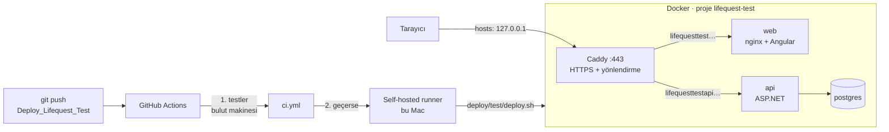

# LifeQuest test ortamı: Docker ile yayın ve CI/CD

Bu rehber test ortamının nasıl çalıştığını, ilk kurulumu ve günlük deploy akışını anlatır. Ortam şu an **bu Mac'te** çalışır ve alan adları yalnızca bu makineden erişilebilir:

| | Adres |
|---|---|
| UI | https://lifequesttest.gvnaitech.com |
| API | https://lifequesttestapi.gvnaitech.com · dokümantasyon: `/scalar/v1` |

---

## 1. Büyük resim



**Kavramlar:**

- **İmaj:** Uygulamanın çalışmaya hazır paketidir; kod, çalışma zamanı ve bağımlılıklar içinde gelir. Tarifi `Dockerfile`'dır:
  - `src/LifeQuest.Api/Dockerfile`: .NET SDK ile derler, küçük `aspnet` imajına kopyalar, root olmayan kullanıcıyla çalışır.
  - `src/LifeQuest.Web/Dockerfile`: Node ile Angular'ı derler, çıktıyı nginx imajına koyar.
- **Container:** İmajın çalışan kopyasıdır. Silinip yeniden oluşturulabilir; kalıcı veri container'da değil **volume**'da durur (`pgdata`, `caddy-data`).
- **Compose:** Birden fazla container'ı tek dosyada tanımlar (`deploy/test/docker-compose.yml`). Servisler aynı sanal ağdadır ve birbirine adla ulaşır (`api:8080`, `postgres:5432`).
- **Reverse proxy (Caddy):** Dışarıya açılan tek kapıdır (80/443). Gelen isteğin alan adına bakıp doğru container'a yollar ve HTTPS sertifikasını yönetir. Veritabanı dışarıya hiç açılmaz.
- **Çalışma anı yapılandırması:** Aynı imaj her ortamda kullanılır; farkı ortam değişkenleri belirler.
  - API: bağlantı dizesi, JWT anahtarı, izin verilen UI kökeni (CORS).
  - Web: `API_BASE_URL` → nginx bunu `/config.js` olarak sunar, Angular açılışta okur.

---

## 2. İlk kurulum (bir kez)

### 2.1 Gizli değerler
Gizli değerler repoda değil, `~/.lifequest-test/.env` dosyasında durur (yalnızca senin okuyabileceğin izinlerle):

```bash
mkdir -p ~/.lifequest-test && cp deploy/test/.env.example ~/.lifequest-test/.env && chmod 600 ~/.lifequest-test/.env
```

`JWT_SECRET` ve `POSTGRES_PASSWORD` değerlerini doldur:

```bash
openssl rand -base64 48
```

> Bu makinede dosya rastgele değerlerle oluşturuldu; tekrar yapman gerekmez.

### 2.2 İlk deploy

```bash
deploy/test/deploy.sh
```

### 2.3 Alan adları ve HTTPS güveni
Bu adım bilgisayarın ayarlarını değiştirdiği için yönetici şifresi ister ve senin çalıştırman gerekir:

```bash
deploy/test/setup-local.sh
```

Script iki şey yapar:
- `/etc/hosts` dosyasına iki alan adını `127.0.0.1` olarak ekler. İşaretli bir blok kullanır; yedeği `/etc/hosts.lifequest-backup`.
- Caddy'nin yerel sertifika otoritesini güvenilir yapar; tarayıcı kilit simgesiyle açılır. Güven yalnızca bu makinededir ve yalnızca Caddy'nin ürettiği test sertifikalarını kapsar.

Geri almak için `deploy/test/setup-local.sh --uninstall`. Firefox kendi sertifika deposunu kullanır; Chrome ve Safari yeterli.

### 2.4 Mac uyumasın
Test sunucusu olarak çalışacaksa, adaptöre bağlıyken uykuyu kapat:

```bash
sudo pmset -c sleep 0
```

Docker Desktop → Settings → General → **"Start Docker Desktop when you sign in to your computer"** açık olsun. Servisler `restart: always` ile tanımlı; Docker açılınca kendiliğinden geri gelirler.

### 2.5 Otomatik deploy için GitHub runner
Runner, GitHub'daki iş akışının bu Mac'te komut çalıştırmasını sağlayan küçük bir servistir.

1. GitHub → repo → **Settings → Actions → Runners → New self-hosted runner → macOS** sayfasını aç. Sayfadaki "Download" komutlarını `~/actions-runner` klasöründe çalıştır.
2. Yapılandırırken etiketi ekle. Token o sayfada görünür ve yalnızca sende kalır:
   ```bash
   ./config.sh --url https://github.com/gvnuysal/gvn.gvnai.lifequest --token <SAYFADAKİ_TOKEN> --labels lifequest-test --name lifequest-mac --unattended
   ```
3. Docker komutunun runner'dan görünmesi için PATH'i ekle:
   ```bash
   echo "PATH=/usr/local/bin:/opt/homebrew/bin:/Applications/Docker.app/Contents/Resources/bin:/usr/bin:/bin:/usr/sbin:/sbin" > .path
   ```
4. Servis olarak kur ve başlat. Mac açılınca kendiliğinden başlar:
   ```bash
   ./svc.sh install && ./svc.sh start
   ```
5. Settings → Actions → General → **"Require approval for all outside collaborators"** seçili olsun.

**Güvenlik:** Repo herkese açık. `deploy-test.yml` yalnızca `Deploy_Lifequest_Test` dalına push'ta çalışır; pull request tetikleyicisi yoktur. Böylece başkalarının fork'larından gelen kod bu makinede çalışmaz. Bu dala yalnızca yazma yetkisi olanlar push edebilir.

---

## 3. Günlük akış

### Otomatik (önerilen)

```bash
git switch Deploy_Lifequest_Test
```

```bash
git merge main
```

```bash
git push
```

GitHub → **Actions → "Deploy · Test"** üzerinde:
1. **Testler:** Backend ve web testleri ile Docker imaj derlemesi GitHub'ın makinesinde çalışır. Biri kırmızıysa deploy yapılmaz.
2. **Test ortamına deploy:** Bu Mac'teki runner `deploy/test/deploy.sh`'i çalıştırır.

### Elle

```bash
deploy/test/deploy.sh
```

### `deploy.sh` adım adım ne yapar?

| Adım | Ne olur | Neden |
|---|---|---|
| 1. Ön kontroller | Docker çalışıyor mu, `.env` var mı, `JWT_SECRET` ≥ 32 karakter mi | Yarım deploy olmasın |
| 2. İmajları derle | `lifequest-api:<commit>`, `lifequest-web:<commit>` | Her sürüm commit kimliğiyle etiketlenir; geri dönüş mümkün |
| 3. Veritabanı yedeği | `pg_dump` → `~/.lifequest-test/backups/` (son 10) | Migration veya veri sorunu olursa geri yükleme |
| 4. Yayına al | `docker compose up -d` | Yalnızca değişen container'lar yeniden oluşturulur; volume'lar korunur |
| 5. Sağlık kontrolü | API `/health`, UI ana sayfa, `/config.js` doğru API adresi | Yayındaki sürümün gerçekten çalıştığını doğrular |
| 6. Başarısızsa geri al | Önceki etiketle `compose up` | Kırık sürüm yayında kalmaz |

Migration'lar API açılışında uygulanır (`Database__MigrateOnStartup=true`). Yedek bu yüzden deploy'dan **önce** alınır.

---

## 4. İşletme

| İş | Komut |
|---|---|
| Durum | `docker compose -p lifequest-test ps` |
| API logları (canlı) | `docker compose -p lifequest-test logs -f api` |
| Tüm loglar (son 100) | `docker compose -p lifequest-test logs --tail=100` |
| Yayındaki sürüm | `cat ~/.lifequest-test/current-tag` |
| Önceki sürüme dön | `deploy/test/rollback.sh` |
| Veritabanıyla birlikte dön | `deploy/test/rollback.sh --restore-db` (onay ister) |
| Veritabanına bağlan | `docker compose -p lifequest-test exec postgres psql -U lifequest` |
| Durdur (veri kalır) | `docker compose -p lifequest-test stop` |
| Yeniden başlat | `docker compose -p lifequest-test start` |
| Her şeyi sil (**veri dahil**) | `docker compose -p lifequest-test down -v` |

Admin hesabı: `.env` içindeki `ADMIN_EMAIL` (varsayılan `admin@lifequest.local`) ile test ortamında **kaydol**. Hesap açılışta admin olur. Test veritabanı geliştirme veritabanından ayrıdır.

---

## 5. Sorun giderme

| Belirti | Sebep / çözüm |
|---|---|
| Siteler birden açılmıyor, `docker compose -p lifequest-test ps` boş | Docker Desktop güncellenip yeniden başlamış olabilir. Servisler `restart: always` ile geri gelir; gelmezse: `docker compose -p lifequest-test start` |
| Tarayıcı "bağlantı güvenli değil" diyor | `setup-local.sh` çalışmamış ya da `caddy-data` volume'u silinip yeni kök sertifika üretilmiş → `setup-local.sh`'i tekrar çalıştır |
| Alan adı açılmıyor | `/etc/hosts` kaydı yok → `setup-local.sh`. Kontrol: `ping -c1 lifequesttest.gvnaitech.com` |
| `deploy.sh`: "port is already allocated" | 80/443'ü başka bir uygulama kullanıyor: `sudo lsof -iTCP:443 -sTCP:LISTEN` |
| UI açılıyor, istekler CORS hatası veriyor | API'deki `Cors__AllowedOrigins__0` UI adresiyle aynı olmalı (`.env` → `UI_HOST`) |
| Actions'ta deploy job'u "Waiting for a runner" | Runner kapalı ya da Mac uyuyor: `~/actions-runner/svc.sh status` |
| Runner'da "docker: command not found" | Runner klasöründeki `.path` dosyası (bkz. 2.5), sonra `./svc.sh stop && ./svc.sh start` |
| Sağlık kontrolü başarısız, geri alındı | Script API/web/caddy loglarını basar; en sık sebep migration veya eksik ortam değişkeni |

---

## 6. İnternete açarken (sonraki adım)

Uygulama tarafında değişiklik gerekmez; yalnızca kapı değişir.

**A. Cloudflare Tunnel (önerilen; port açmak ve sabit IP gerekmez)**
1. `gvnaitech.com` nameserver'ları GoDaddy'den Cloudflare'e taşınır.
2. `docker-compose.yml`'e `cloudflared` servisi eklenir; tünel iki alan adını `caddy:80`'e yönlendirir.
3. TLS'i Cloudflare yapar; Caddy içeride `http://` ile dinler.

**B. Doğrudan (port yönlendirme + Let's Encrypt)**
1. Router'da 80/443 bu Mac'e yönlendirilir.
2. GoDaddy'de iki A kaydı genel IP'ye işaret eder. IP sabit olmalı ya da dinamik DNS kullanılmalı.
3. `.env` içinde `TLS_MODE=ops@gvnaitech.com` yapılır; Caddy gerçek sertifikayı kendisi alır ve yeniler.
4. `setup-local.sh --uninstall` ile hosts kaydı kaldırılır.

Her iki durumda da test ortamı internete açılmadan önce güçlü bir `ADMIN_EMAIL` şifresi, rate limit ayarları ve yedeklerin makine dışına kopyalanması gözden geçirilmelidir.
