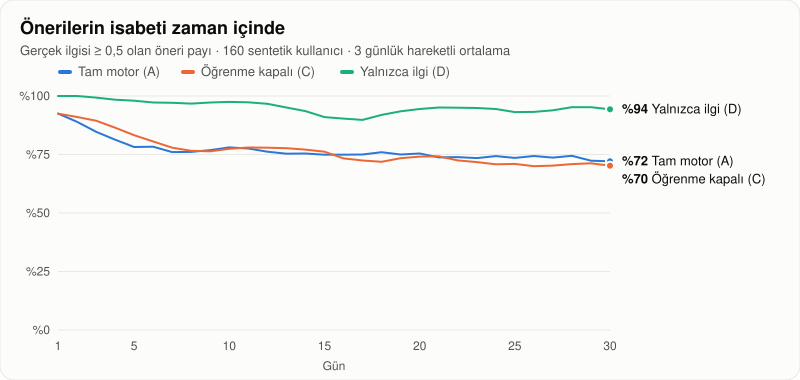
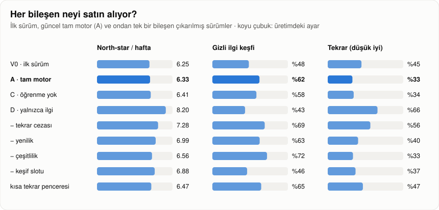
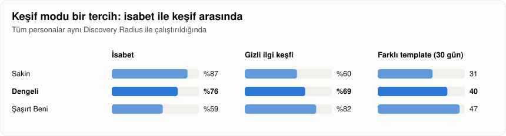
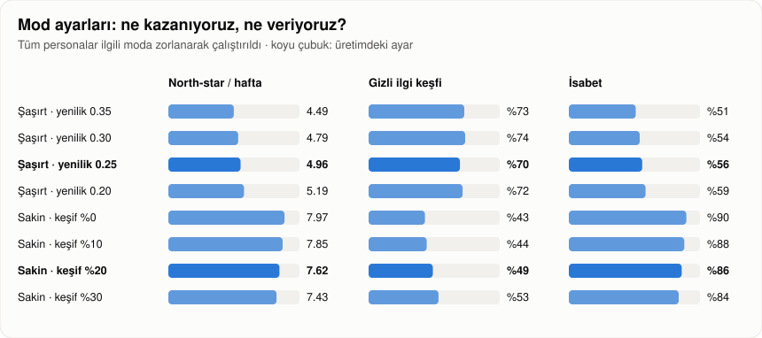

# LifeQuest Öneri Motoru — Offline Simülasyon Raporu

> Bu rapor `tools/LifeQuest.Simulation` tarafından üretilir. 100 template'lik gerçek katalog, 8 persona × 20 tohum = **160 sentetik kullanıcı**, **30 gün**. Motor, domain aggregate'leri, ödül hesabı ve öğrenme kuralları üretimdeki kodun kendisidir; yalnızca kullanıcı davranışı modellenir. Sonuçlar deterministiktir: aynı komut aynı sayıları üretir.

```bash
dotnet run --project tools/LifeQuest.Simulation -- --docs docs
```

## Özet

| Soru | Cevap |
|---|---|
| Kullanıcı ilk 5 dakikada uygun bir quest buluyor mu? | **Evet.** Tüm senaryolarda kullanıcıların %100'ünde ilk günün ilk önerisi hem kısa hem ilgili. |
| Öneriler geri bildirimle isabetleniyor mu? | **Kısmen.** Öğrenme, öğrenmesiz duruma göre son 5 günde isabeti **+6 puan** artırıyor (%70'e karşı %64). Ancak mutlak isabet zamanla düşüyor (%81 → %70), çünkü en ilgili template'ler tamamlanıp cooldown'a girdikçe havuz daralıyor. |
| Analiz sonrası motor değişiklikleri işe yaradı mı? | **Evet.** İlk sürüme göre gizli ilgi keşfi **%48 → %62**, tekrar eden öneri **%45 → %33**. İsabet (%73 → %74) ve north-star (6,25 → 6,33) korunuyor. |
| Keşif ile isabet arasındaki denge kullanıcının kontrolünde mi? | **Evet.** Discovery Radius, Sakin'den Şaşırt Beni'ye isabeti %86'dan %54'e indirirken keşfi %52'den %75'e, katalog kapsamını 29'dan 43 template'e çıkarıyor. |
| Cold start kartları değer katıyor mu? | **Az beyan eden kullanıcıda evet.** Yalnızca tek ilgi beyan edildiğinde isabet **+4 puan** (%67 → %71) artıyor. Zengin beyanda fark gürültü içinde. |
| Efor sınırı erişilebilirliği koruyor mu? | **Evet.** Hareket kısıtı olan persona için kapasiteyi aşan öneri, beyanla %0, beyansız %3. |

## Bulgular

**1. Rastgele keşif pahalıydı, güdümlü keşif değil.** İlk sürümde keşif slotu her gün, ilgi skoru düşük rastgele bir quest seçiyordu ve bu öneriler nadiren kabul görüyordu. Ablasyonda slot kaldırıldığında north-star 6,33'ten 6,88'e çıkıyor ama gizli ilgi keşfi %62'den %46'ya düşüyor. Keşfin ürün tezi için gerekli olduğu, ancak **nereye** keşif yapıldığının önemli olduğu görüldü. Bu yüzden keşif slotu artık önce Taste Graph ile kullanıcının sevdiği bir ilgiye komşu olan quest'leri deniyor ve Dengeli modda günlerin yarısında, Sakin modda beşte birinde açılıyor.

**2. "Gösterildi ama seçilmedi" bir sinyaldir.** İlk sürümde önerilerin %45'i, kullanıcıya son 7 günde zaten gösterilmiş bir template'in tekrarıydı. Tekrar cezası yalnızca 3 günlük bir pencereye bakıyordu. Pencere 7 güne çıkarılıp her görmezden gelinen gösterim için ceza eklendiğinde tekrar %33'e indi. Katalog kapsamı arttı; isabet anlamlı ölçüde değişmedi.

**3. Tekrar ve yenilik cezaları isabetten ödün veriyor, ama kasıtlı olarak.** Yalnızca ilgi skoruna bakan greedy motor en yüksek north-star'ı (8,20) veriyor. Buna karşılık önerilerin üçte ikisi tekrar, gizli ilgi keşfi %43 ve 30 günde yalnızca 20 farklı template görülüyor; bu, analizin kaçınmak istediği "kahve seviyor → hep kahve" döngüsü. Aynı davranışı isteyen kullanıcı Sakin modu seçerek bunu bilinçli olarak alabiliyor (Sakin: north-star 7,59, isabet %86).

**4. Zamanla düşen isabet bir katalog derinliği sorunu.** Cezalar kapatıldığında da düşüş sürüyor (tekrar cezası yokken %88 → %78). Kullanıcı başına 30 günde yaklaşık 36 farklı template tüketiliyor. En sevilenler cooldown'a girince motor bir sonraki en iyi seçeneğe iniyor. Öğrenme bu düşüşü yavaşlatıyor ama durduramıyor.

**5. North-star'daki darboğaz öneri değil, uygulanabilirlik.** Öğrenme isabeti artırsa da north-star'da anlamlı fark yaratmıyor (öğrenmeli 6,33 ±0,14, öğrenmesiz 6,41 ±0,17). Kabul oranını belirleyen asıl etkenler süre, bütçe ve aynı anda en fazla 5 aktif görev kuralı. North-star'ı artırmanın en kısa yolu kısa, ücretsiz ve şehirden bağımsız quest'lerin payını artırmak.

**6. Mod ayarları: Şaşırt Beni fazla agresifti, Sakin fazla kapalıydı.** Tarama (herkes ilgili moda zorlanarak):
- **Şaşırt Beni:** yenilik ağırlığı 0,35'ten 0,25'e indiğinde gizli ilgi keşfi %75'te sabit kalıyor, north-star 4,17'den 4,68'e (+%12), isabet %49'dan %54'e çıkıyor. 0,20'de keşif düşmeye başlıyor (%70), yani 0,25 kırılma noktası. Mod yine de Dengeli'den belirgin biçimde daha keşifçi (43'e karşı 37 farklı template).
- **Sakin:** %10 keşif oranının etkisi gürültü içinde (gizli ilgi %44 → %46). %20'de etki belirgin: gizli ilgi %52, north-star %4 düşüyor (7,93 → 7,59). Sakin modda keşif yalnızca Taste Graph komşusu ve risksiz adaylarla yapılıyor; böyle aday yoksa slot normal öneriye dönüyor.

Persona bazında (önceki ayar → güncel):
- **Az vakitli çalışan** (Sakin): gizli ilgi keşfi **%5 → %45**, north-star 5,55 → 5,79. En büyük kazanç burada.
- **Şaşırt Beni kaşifi:** north-star 3,77 → 4,13, isabet %46 → %49. Hâlâ en düşük north-star'a sahip persona; bu mod bilinçli olarak keşfi seçenler için.
- **Kültür meraklısı** (Sakin): bedeli ödeyen persona. Beyan ettiği ilgiler zaten komşularını kapsadığı için keşiften kazancı yok; north-star 7,21 → 6,70. Sakin keşif oranı `Recommendation:ExplorationRateChill` ile ayarlanabilir veya kapatılabilir.
- **Şehir bilgisi vermeyen** kullanıcıda gizli ilgi keşfi %30'da kalıyor; şehir gerektiren quest'ler filtrelendiği için havuz dar.

> Düzeltme: bu raporun önceki sürümünde persona tablosu ve efor karşılaştırması, senaryo listesinin sırası değiştiği için yanlışlıkla ilk sürüm (V0) verisini gösteriyordu. Tablolar artık güncel motoru (A) gösteriyor.

## Kodda yapılan iyileştirmeler

| Değişiklik | Neden | Etki (V0 → A) |
|---|---|---|
| Keşif slotu Taste Graph komşularını önceliklendirir (`GuidedExploration`) | Rastgele keşif düşük kabul görüyordu | Gizli ilgi keşfi %48 → %62 (tüm değişikliklerle) |
| Dengeli modda keşif slotu olasılıksal: %50 (`ExplorationRateExplore`) | Her gün keşif north-star'dan yiyordu | North-star korundu (6,25 → 6,33) |
| Görmezden gelinen öneri cezası, 7 günlük pencere (`IgnoredOfferPenalty`, `IgnoredOfferWindowDays`) | Önerilerin neredeyse yarısı tekrardı | Tekrar %45 → %33 |
| Şaşırt Beni yeniliği 0,35 → 0,25 (`NoveltySurpriseMe`) | Mod anlamlı deneyimi fazla düşürüyordu | Şaşırt Beni north-star +%12, keşif sabit |
| Sakin modda %20 güdümlü keşif (`ExplorationRateChill`) | Sakin kullanıcı gizli ilgilerini hiç keşfetmiyordu | Az vakitli çalışanda gizli ilgi %5 → %45 |

Tüm ayarlar `appsettings.json → Recommendation` üzerinden değiştirilebilir ve birim testleriyle korunur.

## Öneriler (öncelik sırasıyla)

1. **Katalog derinliği.** Her ilgi alanında en az 3-4 template; özellikle kısa, ücretsiz ve şehirden bağımsız görevler. Zamanla düşen isabetin ve north-star darboğazının ortak çözümü bu.
2. **"Sevdiğin bir deneyimi tekrarla."** 5 puan verilmiş template'ler cooldown bittikten sonra yenilik cezasından muaf tutulmalı. Keşif tezine zarar vermeden geç dönem isabetini destekler.
3. **Cold start kartlarını hedefle.** İki ya da daha az ilgi seçen kullanıcıya kart adımı vurgulu gösterilmeli; zengin beyanda atlanabilir kalmalı.
4. **Gerçek veriyle doğrulama.** Mod ayarları (Şaşırt Beni 0,25, Sakin %20) dahil; saklanan skor dökümleri ve `/api/v1/admin/metrics` ile aynı metrikler canlı veride izlenmeli. Contextual bandit'e geçiş için gereken veri zaten toplanıyor.

## Sonuçlar



### Ana senaryolar

| Senaryo | İsabet | İlk 5 → son 5 gün | Kabul | North-star / hafta | Puan | Kategori | Katalog | Tekrar | Gizli ilgi keşfi | Gün 1 |
|---|---|---|---|---|---|---|---|---|---|---|
| **V0** İlk sürüm (analiz öncesi) | %73 ±1 | %78 → %70 | %41 | 6.25 ±0.14 | 4.1 | 4.8 | 34 | %45 | %48 ±3 | %100 |
| **A** Tam motor + cold start kartları | %74 ±1 | %81 → %72 | %42 | 6.42 ±0.14 | 4.1 | 4.8 | 35 | %34 | %61 ±3 | %100 |
| **B** Tam motor, kartsız | %74 ±1 | %83 → %71 | %42 | 6.54 ±0.14 | 4.1 | 4.8 | 36 | %35 | %65 ±3 | %100 |
| **C** Öğrenme kapalı | %71 ±1 | %84 → %67 | %41 | 6.53 ±0.17 | 4.1 | 4.9 | 34 | %36 | %57 ±3 | %100 |
| **D** Yalnızca ilgi skoru (greedy) | %94 ±1 | %98 → %94 | %51 | 8.20 ±0.16 | 4.2 | 4.3 | 20 | %66 | %43 ±3 | %100 |

### Ablasyon: tam motordan tek bileşen çıkarıldığında



| Senaryo | İsabet | İlk 5 → son 5 gün | Kabul | North-star / hafta | Puan | Kategori | Katalog | Tekrar | Gizli ilgi keşfi | Gün 1 |
|---|---|---|---|---|---|---|---|---|---|---|
| **A** Tam motor + cold start kartları | %74 ±1 | %81 → %72 | %42 | 6.42 ±0.14 | 4.1 | 4.8 | 35 | %34 | %61 ±3 | %100 |
| **X-Rep** A − tekrar cezası | %82 ±1 | %88 → %79 | %46 | 7.26 ±0.14 | 4.1 | 4.4 | 27 | %57 | %68 ±3 | %100 |
| **X-Nov** A − yenilik | %80 ±1 | %84 → %76 | %44 | 6.99 ±0.14 | 4.1 | 4.5 | 32 | %40 | %63 ±3 | %100 |
| **X-Div** A − çeşitlilik | %76 ±1 | %83 → %72 | %43 | 6.77 ±0.14 | 4.1 | 4.7 | 34 | %36 | %67 ±3 | %100 |
| **X-Exp** A − keşif slotu | %81 ±1 | %90 → %80 | %46 | 7.12 ±0.16 | 4.1 | 4.7 | 30 | %39 | %46 ±3 | %100 |
| **X-Ign3** A, eski tekrar penceresi (3 gün) | %76 ±1 | %82 → %74 | %43 | 6.58 ±0.14 | 4.1 | 4.8 | 32 | %48 | %64 ±3 | %100 |

### Cold start: kullanıcı onboarding'de yalnızca tek ilgi beyan ederse

| Senaryo | İsabet | İlk 5 → son 5 gün | Kabul | North-star / hafta | Puan | Kategori | Katalog | Tekrar | Gizli ilgi keşfi | Gün 1 |
|---|---|---|---|---|---|---|---|---|---|---|
| **S-A** Tek ilgi beyanı + kartlar | %72 ±1 | %79 → %71 | %40 | 6.11 ±0.16 | 4.1 | 4.8 | 36 | %33 | %62 ±3 | %100 |
| **S-B** Tek ilgi beyanı, kartsız | %68 ±1 | %77 → %68 | %38 | 5.80 ±0.17 | 4.1 | 4.7 | 37 | %32 | %66 ±3 | %100 |

### Discovery Radius



| Senaryo | İsabet | İlk 5 → son 5 gün | Kabul | North-star / hafta | Puan | Kategori | Katalog | Tekrar | Gizli ilgi keşfi | Gün 1 |
|---|---|---|---|---|---|---|---|---|---|---|
| **R-Chill** Herkes Sakin | %86 ±1 | %92 → %83 | %48 | 7.62 ±0.15 | 4.2 | 4.5 | 29 | %47 | %49 ±3 | %100 |
| **R-Explore** Herkes Dengeli | %73 ±1 | %82 → %69 | %41 | 6.41 ±0.13 | 4.1 | 4.9 | 36 | %31 | %63 ±3 | %100 |
| **R-Surprise** Herkes Şaşırt Beni | %56 ±1 | %67 → %53 | %33 | 4.96 ±0.13 | 4.1 | 5.0 | 42 | %22 | %70 ±3 | %100 |

### Mod ayarları: Şaşırt Beni yeniliği ve Sakin keşif oranı



Herkes ilgili moda zorlanarak çalıştırıldı. Üretim değerleri: Şaşırt Beni yeniliği **0.25**, Sakin keşif oranı **0.2**.

| Senaryo | İsabet | İlk 5 → son 5 gün | Kabul | North-star / hafta | Puan | Kategori | Katalog | Tekrar | Gizli ilgi keşfi | Gün 1 |
|---|---|---|---|---|---|---|---|---|---|---|
| **SN0.35** Şaşırt Beni, yenilik 0.35 | %51 ±1 | %65 → %47 | %31 | 4.49 ±0.13 | 4.0 | 5.2 | 44 | %21 | %73 ±3 | %100 |
| **SN0.30** Şaşırt Beni, yenilik 0.30 | %54 ±1 | %66 → %50 | %32 | 4.79 ±0.12 | 4.1 | 5.0 | 43 | %21 | %74 ±3 | %100 |
| **SN0.25** Şaşırt Beni, yenilik 0.25 | %56 ±1 | %67 → %53 | %33 | 4.96 ±0.13 | 4.1 | 5.0 | 42 | %22 | %70 ±3 | %100 |
| **SN0.20** Şaşırt Beni, yenilik 0.20 | %59 ±1 | %69 → %55 | %35 | 5.19 ±0.13 | 4.1 | 5.0 | 41 | %24 | %72 ±3 | %100 |
| **CR0.0** Sakin, keşif oranı 0.0 | %90 ±1 | %95 → %88 | %50 | 7.97 ±0.16 | 4.2 | 4.5 | 25 | %50 | %43 ±3 | %100 |
| **CR0.1** Sakin, keşif oranı 0.1 | %88 ±1 | %94 → %85 | %49 | 7.85 ±0.16 | 4.2 | 4.5 | 27 | %48 | %44 ±3 | %100 |
| **CR0.2** Sakin, keşif oranı 0.2 | %86 ±1 | %92 → %83 | %48 | 7.62 ±0.15 | 4.2 | 4.5 | 29 | %47 | %49 ±3 | %100 |
| **CR0.3** Sakin, keşif oranı 0.3 | %84 ±1 | %90 → %81 | %47 | 7.43 ±0.14 | 4.2 | 4.6 | 30 | %45 | %53 ±3 | %100 |

Persona bazında önceki mod ayarları (A0: yenilik 0,35, Sakin'de keşif yok) ile güncel ayarlar (A):

| Persona | Keşif modu | İsabet A0 → A | North-star A0 → A | Gizli ilgi keşfi A0 → A |
|---|---|---|---|---|
| Kahve ve kafe tutkunu | Explore | %65 → %65 | 4.81 → 4.81 | %85 → %85 |
| Kültür meraklısı | Chill | %86 → %82 | 7.26 → 6.69 | %83 → %80 |
| Düşük bütçeli öğrenci | Explore | %76 → %76 | 6.78 → 6.78 | %83 → %83 |
| Az vakitli çalışan | Chill | %100 → %97 | 5.68 → 5.69 | %5 → %45 |
| Hareket kısıtı olan kullanıcı | Explore | %71 → %71 | 5.65 → 5.65 | %95 → %95 |
| Sosyal kelebek | Explore | %74 → %74 | 9.04 → 9.04 | %48 → %48 |
| Şehir bilgisi vermeyen doğa sever | Explore | %79 → %79 | 8.45 → 8.45 | %25 → %25 |
| Şaşırt Beni kaşifi | SurpriseMe | %48 → %51 | 4.03 → 4.29 | %30 → %20 |

### Sevdiğini tekrarla

5 puan (veya "daha fazla") verilen template cooldown bittikten sonra 0,2 yerine bu yenilik skoruyla yeniden önerilebilir. 0,2 özelliğin kapalı olması demektir. Üretim değeri **0.6**.

| Senaryo | İsabet | İlk 5 → son 5 gün | Kabul | North-star / hafta | Puan | Kategori | Katalog | Tekrar | Gizli ilgi keşfi | Gün 1 |
|---|---|---|---|---|---|---|---|---|---|---|
| **LR0.2** Sevdiğini tekrarla, yenilik 0.2 | %74 ±1 | %81 → %70 | %41 | 6.33 ±0.14 | 4.1 | 4.8 | 36 | %33 | %62 ±3 | %100 |
| **LR0.4** Sevdiğini tekrarla, yenilik 0.4 | %74 ±1 | %81 → %69 | %41 | 6.40 ±0.15 | 4.1 | 4.7 | 35 | %33 | %62 ±3 | %100 |
| **LR0.6** Sevdiğini tekrarla, yenilik 0.6 | %74 ±1 | %81 → %72 | %42 | 6.42 ±0.14 | 4.1 | 4.8 | 35 | %34 | %61 ±3 | %100 |
| **LR0.8** Sevdiğini tekrarla, yenilik 0.8 | %75 ±1 | %81 → %72 | %42 | 6.56 ±0.15 | 4.1 | 4.7 | 35 | %35 | %63 ±3 | %100 |

### Erişilebilirlik: hareket kısıtı olan persona

| Senaryo | Kapasitesini aşan öneri | İsabet | North-star / hafta |
|---|---|---|---|
| Efor sınırı beyan edildi | %0 | %71 | 5.65 |
| Efor sınırı beyan edilmedi | %3 | %70 | 5.75 |

### Persona kırılımı (senaryo A)

| Persona | Keşif modu | İsabet | İlk 5 gün | Son 5 gün | North-star / hafta | Tamamlanan kategori | Gizli ilgi keşfi |
|---|---|---|---|---|---|---|---|
| Kahve ve kafe tutkunu | Explore | %65 | %68 | %67 | 4.81 | 4.6 | %85 |
| Kültür meraklısı | Chill | %82 | %89 | %78 | 6.69 | 4.5 | %80 |
| Düşük bütçeli öğrenci | Explore | %76 | %83 | %75 | 6.78 | 4.3 | %83 |
| Az vakitli çalışan | Chill | %97 | %99 | %94 | 5.69 | 4.5 | %45 |
| Hareket kısıtı olan kullanıcı | Explore | %71 | %80 | %68 | 5.65 | 4.1 | %95 |
| Sosyal kelebek | Explore | %74 | %83 | %67 | 9.04 | 5.9 | %48 |
| Şehir bilgisi vermeyen doğa sever | Explore | %79 | %85 | %76 | 8.45 | 4.4 | %25 |
| Şaşırt Beni kaşifi | SurpriseMe | %51 | %62 | %47 | 4.29 | 6.0 | %20 |

## Yöntem

**Personalar.** Her personanın gizli bir gerçek ilgi haritası vardır (listede olmayan ilgiler 0,15). Onboarding'de bunun yalnızca bir kısmını beyan eder; "gizli" ilgiler kullanıcının sevdiği ama söylemediği alanlardır. Sistem bunları keşfederse (öğrenilmiş ağırlık ≥ 0,4 ya da o etiketle bir quest tamamlanırsa) "gizli ilgi keşfi" sayılır.

| Persona | Beyan edilen | Gizli | Bütçe | Haftalık süre | Şehir | Fiziksel kapasite |
|---|---|---|---|---|---|---|
| Kahve ve kafe tutkunu | coffee, cafe-culture, street-food | architecture, photography | Medium | 300 dk | var | Vigorous |
| Kültür meraklısı | cinema, museums, art | writing, architecture | Medium | 300 dk | var | Vigorous |
| Düşük bütçeli öğrenci | reading, languages, friends | science, astronomy | Free | 600 dk | var | Vigorous |
| Az vakitli çalışan | podcasts, yoga, cooking | meditation | Low | 120 dk | var | Vigorous |
| Hareket kısıtı olan kullanıcı | crafts, drawing, art | writing, music-making | Low | 300 dk | var | Light |
| Sosyal kelebek | friends, board-games, live-music | dance, volunteering | Medium | 600 dk | var | Vigorous |
| Şehir bilgisi vermeyen doğa sever | walking, photography, nature | gardening, astronomy | Free | 300 dk | yok | Vigorous |
| Şaşırt Beni kaşifi | photography, cooking | cycling, dance | Medium | 600 dk | var | Vigorous |

**Davranış modeli.** Her gün motor 3 öneri üretir (yerel saat 18:30). Kabul olasılığı `0,85 × ilgi^1,5`; bütçe konforunu aşarsa ×0,2, oturum süresini aşarsa ×0,35, fiziksel kapasiteyi aşarsa 0. Aynı anda en fazla 5 aktif görev. Kabul edilen görev `0,55 + 0,4 × ilgi` olasılıkla tamamlanır (günlük aynı gün, haftalık 1-4 gün, macera 3-10 gün). Tamamlananların %70'i puanlanır: `1 + 4 × (ilgi ± gürültü)`; 5 puanın bir kısmı "daha fazla", 1-2 puanın bir kısmı "daha az" tercihi taşır. Kabul edilmeyen önerilerin %60'ı sebep belirtilerek geçilir (ilgi < 0,35 → ilgimi çekmedi, sonra pahalı / zamanım yok / bugün değil). Öğrenme adımları API handler'larıyla aynı `InterestLearning` sabitlerini kullanır.

**Metrikler.**

- **İsabet:** gerçek ilgisi ≥ 0,5 olan öneri payı (± kullanıcılar arası standart hata).
- **North-star:** haftalık anlamlı deneyim; tamamlanmış ve puansız ya da ≥ 4 puanlı quest sayısı.
- **Tekrar:** son 7 günde aynı kullanıcıya zaten gösterilmiş template'in payı.
- **Çeşitlilik:** günlük 3'lü listedeki farklı kategori sayısı.
- **Katalog kapsamı:** 30 günde gösterilen farklı template sayısı.
- **Gün 1:** ilk günün ilk önerisi hem kısa hem ilgili mi ("ilk 5 dakikada uygun quest" başarı ölçütü).

## Sınırlar

- Davranış modeli bir varsayımdır; mutlak değerler değil, **senaryolar arası farklar** yorumlanmalıdır (ortak rastgele sayılar kullanıldığı için bu farklar gürültüye karşı dayanıklıdır).
- "Gerçek ilgi" statiktir; gerçek kullanıcıların zevki deneyimle değişir. Ayrıca hava, mekân açıklığı ve sosyal etki modellenmedi.
- Gerçek kullanıcı verisi geldiğinde aynı metrikler `/api/v1/admin/metrics` ve saklanan skor dökümleriyle doğrulanmalı, ağırlıklar A/B testiyle ayarlanmalıdır.
